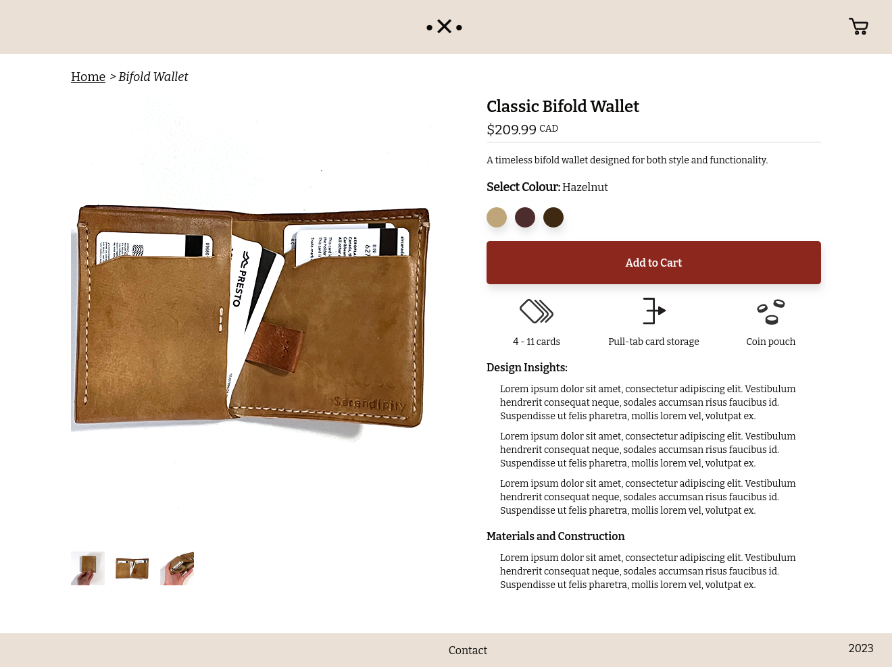

# Leatherworks

Online catalogue using React, Typescript, Sass, Tailwind CSS, and React Router, with ASP.NET Core and MongoDB on the backend.

Dynamically loads content from backend, and features a persistent cart using local storage.

Unfortunately, the demo does not work due to not having a CA Certificate.

These wallets are actually made by me :)

## Screenshots

*Leatherworks home page*

*Leatherworks item page*

*Leatherworks cart*